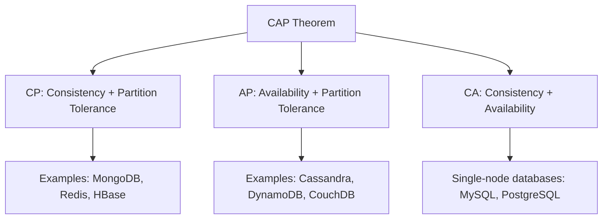

Building scalable systems is both an art and a science. While specific technologies come and go, the underlying principles remain remarkably consistent. In this article, we'll explore the core principles that guide effective system design.

## The CAP Theorem: Understanding Trade-offs

The CAP theorem states that a distributed system can only guarantee two out of three properties:

- **Consistency**: Every read receives the most recent write
- **Availability**: Every request receives a response
- **Partition Tolerance**: The system continues operating despite network partitions



**Practical Application**: Choose your database based on your consistency requirements. For social media feeds (AP systems), eventual consistency is acceptable. For financial transactions (CP systems), strong consistency is non-negotiable.

## Scalability Patterns

### Horizontal vs Vertical Scaling

```typescript
// Vertical scaling: Add more resources to a single node
const verticalScaling = {
  approach: "Scale up",
  method: "Increase CPU/RAM/Storage",
  pros: ["Simple", "No code changes"],
  cons: ["Single point of failure", "Physical limits"],
  useCase: "Monolithic applications"
}

// Horizontal scaling: Add more nodes
const horizontalScaling = {
  approach: "Scale out", 
  method: "Add more servers",
  pros: ["Fault tolerance", "Theoretically unlimited"],
  cons: ["Complex", "Requires distributed systems knowledge"],
  useCase: "Microservices, cloud-native apps"
}
```

### Load Balancing Strategies

1. **Round Robin**: Distribute requests sequentially
2. **Least Connections**: Send to server with fewest active connections
3. **IP Hash**: Consistent hashing based on client IP
4. **Weighted**: Assign weights based on server capacity

```python
# Example: Consistent hashing for load balancing
import hashlib

class ConsistentHashLoadBalancer:
    def __init__(self, nodes, replicas=3):
        self.replicas = replicas
        self.ring = {}
        self.sorted_keys = []
        
        for node in nodes:
            for i in range(replicas):
                key = self.hash(f"{node}:{i}")
                self.ring[key] = node
                self.sorted_keys.append(key)
        self.sorted_keys.sort()
    
    def hash(self, key):
        return int(hashlib.md5(key.encode()).hexdigest(), 16)
    
    def get_node(self, key):
        if not self.ring:
            return None
        
        hash_key = self.hash(key)
        for ring_key in self.sorted_keys:
            if hash_key <= ring_key:
                return self.ring[ring_key]
        return self.ring[self.sorted_keys[0]]
```

## Database Design Patterns

### Read-Write Splitting

Separate read and write operations to different database instances:

```sql
-- Write operations go to primary
INSERT INTO users (name, email) VALUES ('John', 'john@example.com');

-- Read operations go to replicas
SELECT * FROM users WHERE email = 'john@example.com';
```

### Database Sharding

Split data across multiple databases based on a shard key:

```typescript
interface ShardingStrategy {
  shardKey: string;
  shardCount: number;
  
  getShard(data: any): number;
}

class UserSharding implements ShardingStrategy {
  shardKey = 'userId';
  shardCount = 4;
  
  getShard(user: User): number {
    // Simple hash-based sharding
    const hash = this.hash(user.id);
    return hash % this.shardCount;
  }
  
  private hash(str: string): number {
    let hash = 0;
    for (let i = 0; i < str.length; i++) {
      hash = ((hash << 5) - hash) + str.charCodeAt(i);
      hash |= 0; // Convert to 32bit integer
    }
    return Math.abs(hash);
  }
}
```

## Caching Strategies

### Cache-Aside (Lazy Loading)

```typescript
class CacheAsideService {
  constructor(private cache: Cache, private db: Database) {}
  
  async getUser(userId: string): Promise<User> {
    // 1. Check cache first
    let user = await this.cache.get(`user:${userId}`);
    
    if (!user) {
      // 2. Cache miss: load from database
      user = await this.db.getUser(userId);
      
      if (user) {
        // 3. Populate cache for future requests
        await this.cache.set(`user:${userId}`, user, { ttl: 3600 });
      }
    }
    
    return user;
  }
}
```

### Write-Through Cache

```typescript
class WriteThroughCache {
  constructor(private cache: Cache, private db: Database) {}
  
  async updateUser(userId: string, updates: Partial<User>): Promise<void> {
    // 1. Update database
    const updatedUser = await this.db.updateUser(userId, updates);
    
    // 2. Update cache synchronously
    await this.cache.set(`user:${userId}`, updatedUser, { ttl: 3600 });
  }
}
```

## Message Queue Patterns

### Event-Driven Architecture

```typescript
interface Event {
  type: string;
  payload: any;
  timestamp: Date;
}

class EventBus {
  private subscribers: Map<string, Function[]> = new Map();
  
  subscribe(eventType: string, handler: Function): void {
    if (!this.subscribers.has(eventType)) {
      this.subscribers.set(eventType, []);
    }
    this.subscribers.get(eventType)!.push(handler);
  }
  
  publish(event: Event): void {
    const handlers = this.subscribers.get(event.type) || [];
    handlers.forEach(handler => handler(event.payload));
  }
}

// Usage
const eventBus = new EventBus();

// Order service subscribes to payment events
eventBus.subscribe('payment.processed', (payment) => {
  orderService.fulfillOrder(payment.orderId);
});

// Payment service publishes events
eventBus.publish({
  type: 'payment.processed',
  payload: { orderId: '123', amount: 99.99 },
  timestamp: new Date()
});
```

## Monitoring and Observability

### The Three Pillars of Observability

1. **Metrics**: Quantitative measurements (CPU, memory, request rate)
2. **Logs**: Structured event records
3. **Traces**: End-to-end request flow

```yaml
# Example: Prometheus metrics configuration
scrape_configs:
  - job_name: 'api-service'
    static_configs:
      - targets: ['localhost:9090']
    metrics_path: '/metrics'
    
  - job_name: 'database'
    static_configs:
      - targets: ['localhost:9100']
```

### SLOs and Error Budgets

```typescript
interface ServiceLevelObjective {
  name: string;
  description: string;
  measurement: 'availability' | 'latency' | 'throughput';
  target: number; // e.g., 99.9% availability
  window: string; // e.g., '30d'
  
  calculateErrorBudget(): number;
  isViolated(): boolean;
}
```

## Conclusion

System design is about making informed trade-offs. There's no one-size-fits-all solution, but understanding these principles gives you a framework for making decisions:

1. **Start simple**: Don't over-engineer prematurely
2. **Measure everything**: You can't improve what you don't measure
3. **Plan for failure**: Assume everything will fail
4. **Embrace constraints**: Work within your team's expertise and infrastructure
5. **Iterate**: Systems evolve, so design for change

Remember: The best system is the one that meets your requirements while being understandable and maintainable by your team. Complexity should be a last resort, not a first choice.

**Further Reading**:
- "Designing Data-Intensive Applications" by Martin Kleppmann
- "Site Reliability Engineering" by Google
- "The System Design Primer" on GitHub